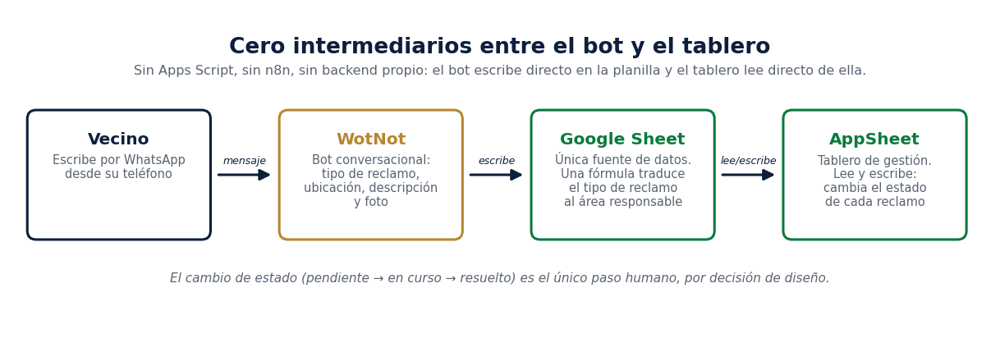
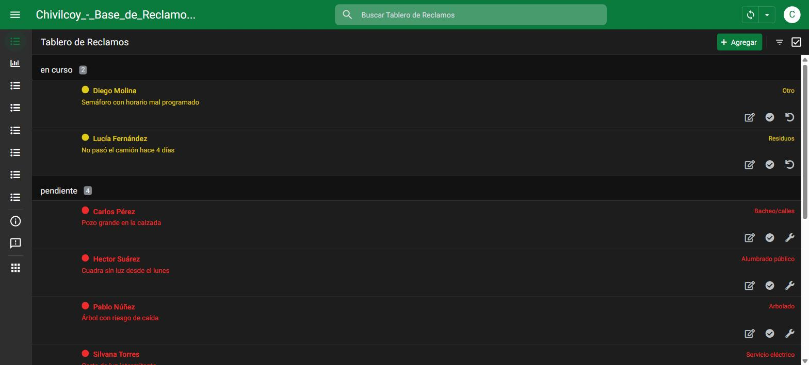
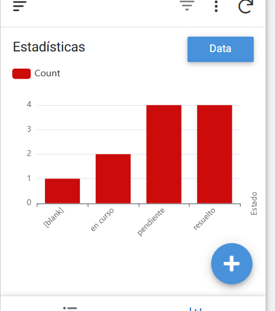

# Tablero de Reclamos — Municipalidad de Chivilcoy

Trabajo Final Integrador — Diplomatura en IA Aplicada a Entornos Digitales de Gestión (FCE-UBA, Cohorte 2026).
Autora: Ivana Jacobs.

## Qué hace

Un sistema para que un vecino de Chivilcoy haga un reclamo por WhatsApp (bache, luminaria, poda, etc.) y ese reclamo llegue organizado, clasificado por área y visible en un tablero de gestión, sin que nadie tenga que cargar nada a mano.

## Para qué sirve

Hoy, en muchos municipios chicos, los reclamos vecinales se gestionan por WhatsApp informal, cuadernos o planillas sueltas: se pierden, se duplican, nadie sabe qué está pendiente y qué ya se resolvió. Este proyecto propone un circuito mínimo, sin intermediarios innecesarios, para que:

- el vecino reclame por el canal que ya usa (WhatsApp),
- el reclamo quede clasificado por área automáticamente,
- el equipo municipal vea de un vistazo qué está pendiente, en curso y resuelto, por área.

## Cómo funciona (arquitectura)

```
Vecino (WhatsApp)
      │
      ▼
  WotNot (bot conversacional)
  · pide tipo de reclamo, descripción, ubicación y foto
      │
      ▼
  Google Sheet (única fuente de datos)
  · una fórmula traduce el tipo de reclamo al área responsable
      │
      ▼
  AppSheet (tablero de gestión)
  · lista agrupada por estado (pendiente / en curso / resuelto)
  · código de color por estado y cambio de estado con un toque
  · vista de estadísticas y pestañas por área
```



**Decisión de diseño deliberada: cero intermediarios extra.** Se evaluó sumar una capa intermedia tipo Apps Script o n8n para "traducir" datos entre el bot y el tablero, y se descartó a propósito. La planilla de Sheets es la única fuente de verdad; el bot escribe ahí directamente y AppSheet lee de ahí directamente. Menos piezas, menos puntos de falla, más fácil de mantener por alguien sin perfil técnico — que es exactamente el contexto real de un equipo municipal chico.

Ver el detalle completo de decisiones tomadas y por qué en [`docs/decisiones.md`](docs/decisiones.md).

## Nivel de implementación

Este proyecto es un **piloto funcional verificado de punta a punta**, no un servicio en operación municipal. El circuito completo —bot, planilla, tablero— está construido, configurado y probado: se recorrió el flujo entero cargando un reclamo de prueba y comprobando que llegara clasificado al tablero en segundos.

Lo que todavía no ocurrió es el despliegue con vecinos reales. No se dispone de la línea de WhatsApp oficial de la Municipalidad, de modo que el bot se construyó y probó sobre un número propio y no está publicado en un canal abierto al público. Los reclamos que se ven en las capturas son casos de prueba cargados para validar el comportamiento del sistema.

Encuadra como **Nivel 1 (implementación funcional)**, con la particularidad de que el medio no es código tradicional sino una integración no-code (bot conversacional + planilla + app de gestión). No hay backend propio para desplegar ni notebook que correr: las tres piezas (WotNot, Google Sheets, AppSheet) están configuradas y funcionando.

## Cómo se usa

- **El vecino**: escribe al número de WhatsApp del municipio y el bot lo guía con preguntas cortas (tipo de reclamo, descripción, ubicación y foto); el área responsable se asigna sola a partir del tipo elegido. Este es el paso que falta desplegar.
- **El equipo municipal**: abre la app de AppSheet (web o celular) y ve el tablero agrupado por estado. Cada reclamo está codificado por color —rojo pendiente, amarillo en curso, verde resuelto— y el estado se cambia con un solo toque, sin abrir un formulario.

### Capturas

**Tablero de Reclamos (agrupado por estado, con código de color):**



**Estadísticas (conteo de reclamos por estado):**



## Evolución del proyecto

El proceso importa tanto como el resultado final, así que queda registrado lo que se sumó después de la primera versión:

- **Pestañas por área en AppSheet.** Seis vistas nuevas, una por área responsable (Alumbrado Público, Obras Públicas, Higiene Urbana, Espacios Verdes, Cooperativa Eléctrica, Mesa de Entradas), para que cada responsable encuentre directo los reclamos de su área. **Es organización visual, no control de acceso real** — cualquier persona con la app todavía ve las seis pestañas; eso depende del filtro de seguridad que sigue pendiente.
- **Identidad visual y código de color.** El tablero usa la paleta institucional de Chivilcoy (verde `#0A7A3D`), modo oscuro y un código de color tipo semáforo por estado. Implementarlo requirió desdoblar cada estado en dos reglas de formato, porque en AppSheet el color de resaltado no pinta el fondo sino que dibuja un punto antes de cada columna formateada.
- **Prototipo de tablero web.** Se exploró una página propia de solo lectura sobre la misma planilla, como ejercicio de identidad de producto. Queda registrada acá pero **no forma parte del sistema que se presenta**: la herramienta de gestión del circuito es AppSheet.

## Contenido generado con IA

- **Diseño y corrección del circuito completo** (bot → planilla → app): asistido con Claude (Anthropic) en Cowork, incluyendo depuración de la integración AppSheet–Google Sheets, corrección de vistas, reglas de formato condicional por estado y resolución de un bug de fuente de datos en la vista de Estadísticas.
- **Identidad visual del tablero**: escudo oficial de la Municipalidad de Chivilcoy integrado en la planilla y en la app.
- El flujo conversacional del bot (WotNot) fue diseñado y configurado sin generación automática de contenido conversacional por IA en esta etapa.

Detalle de metodología, prompts y decisiones —incluyendo los errores encontrados y cómo se corrigieron— en el informe PDF que acompaña esta entrega.

## Estado del proyecto

- ✅ Bot conversacional de WhatsApp construido y probado de punta a punta.
- ✅ Planilla como fuente única de datos.
- ✅ Clasificación automática por área responsable (menú del bot + fórmula de traducción en la planilla).
- ✅ Tablero en AppSheet agrupado por estado, con código de color y cambio de estado con un toque.
- ✅ Vista de estadísticas por estado.
- ✅ Pestañas por área en AppSheet (organización visual).
- ⏳ Despliegue del bot en una línea de WhatsApp abierta a vecinos: pendiente, depende de una decisión del municipio.
- ⏳ Filtro de seguridad por área (cada responsable ve solo su área): pausado, pendiente de relevar los emails de los responsables municipales.

## Informe

El informe completo del TP (estructura a–f exigida por la consigna, incluyendo factibilidad, impacto y el análisis con las cuatro dimensiones AIBPS) está en [`informe-TP-tablero-reclamos-chivilcoy.pdf`](informe-TP-tablero-reclamos-chivilcoy.pdf), en la raíz de este repositorio.
